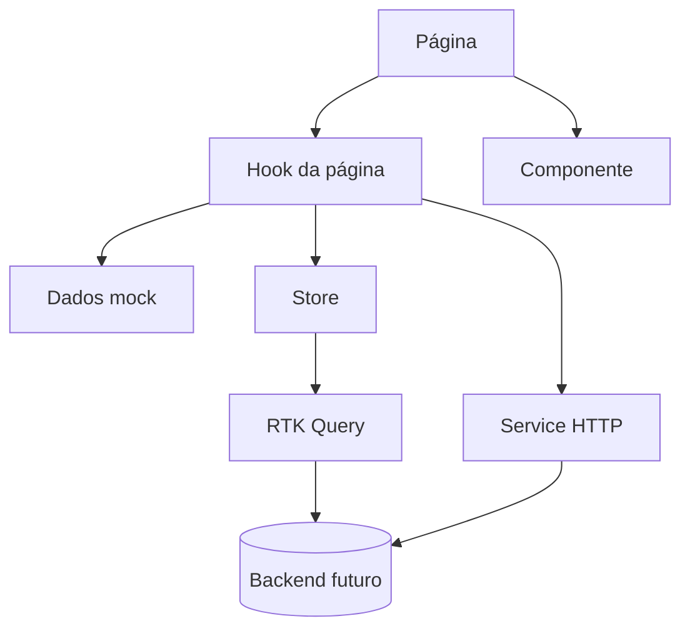

# Arquitetura do frontend

Frontend do portfólio pessoal de Luiz Felipe dos Santos: React 19 e TypeScript, com Vite, Redux Toolkit e RTK Query, i18next, CSS Modules e Vitest. As convenções detalhadas de código ficam no `.claude/CLAUDE.md`; este documento descreve a forma geral da aplicação.

## Camadas

- **Página** (`src/pages/<Nome>.page.tsx`): ligada a uma rota; só chama o hook e renderiza o resultado, com `<title>` e `<meta name="description">` declarados no próprio JSX.
- **Hook da página** (`src/pages/hooks/use<Nome>.ts`): estado, efeitos e acesso a dados ficam fora do JSX. Hooks reutilizáveis entre telas ficam em `src/hooks/`.
- **Componente** (`src/components/`): UI reutilizável, sem rota própria, construída a partir dos componentes do design system do handoff.
- **Layout** (`src/layouts/Main.layout.tsx`): cabeçalho, conteúdo e rodapé comuns às páginas.
- **Store** (`src/store/`): estado compartilhado em slices e estado de servidor em endpoints do RTK Query.
- **Service HTTP** (`src/services/http/`): `get` e `post` sobre `fetch`, para chamadas fora do RTK Query.
- **Dados mock:** enquanto o backend não existe, o conteúdo vem de dados locais do frontend (R1). As pastas `src/pages/hooks/`, `src/hooks/` e `src/components/` nascem no primeiro uso.

## Roteamento

Todas as rotas ficam em `src/routers/routes.tsx`, com os paths em `src/routers/paths.ts`. O `MainLayout` é a rota-pai, as páginas são filhas carregadas sob demanda (`lazy`) e o único `<Suspense>` fica em volta do `<Outlet />` do layout. A rota `*` leva à página não encontrada e fica por último; a página de erro é o `errorElement` da rota do layout e renderiza sem ele.

| Rota              | Tela                  | Situação                        |
| ----------------- | --------------------- | ------------------------------- |
| `/`               | Início                | Existe, com o hero mínimo       |
| `*`               | Página não encontrada | Existe                          |
| `/projetos`       | Projetos              | Prevista no handoff, sem página |
| `/projetos/:slug` | Projeto               | Prevista no handoff, sem página |
| `/informacoes`    | Informações           | Prevista no handoff, sem página |
| `/contato`        | Contato               | Prevista no handoff, sem página |

Uma rota só entra em `paths.ts` junto com a página que ela renderiza. Navegação interna usa `<Link>` ou `useNavigate` com o path de `ROUTES`.

## Estado

Hoje a store não tem slice nem endpoint: `src/store/api.ts` declara o `createApi` sem endpoints e o `rootReducer` só registra o reducer do RTK Query. A infraestrutura fica pronta para o backend futuro. A decisão está em [ADR 0001](../adr/0001-state-management.md).

- **Estado de uma tela** fica em `useState` no hook da página. O handoff define o estado de cada tela:

| Tela        | Estado                                                                                                     |
| ----------- | ---------------------------------------------------------------------------------------------------------- |
| Todas       | Tema claro ou escuro; indicador de e-mail copiado no botão de copiar e-mail, que volta em 2,2 s            |
| Projetos    | Busca, tipo, categoria, ordenação, filtros ativos, modal de filtros aberto, carregando, quantidade visível |
| Projeto     | Foto atual da galeria, lightbox aberto, arquivo ativo                                                      |
| Informações | Item de experiência ou formação aberto                                                                     |
| Contato     | Nome, e-mail, mensagem, assunto, erros por campo, tocado, enviando, enviado                                |

- **Estado compartilhado** entre telas vai para um slice em `src/store/slices/`.
- **Dados de projetos e trajetória** (experiências, formações, stack) começam como mock no frontend, porque o backend ainda não existe (R1). Quando o backend existir, cada domínio vira um endpoint do RTK Query injetado em `src/store/api/<dominio>.api.ts`, e o envio do formulário de contato passa a usar o backend.
- **Idioma** continua em `src/i18n/`, fora da store.

## Estilo

CSS Modules com escopo por arquivo: estilo de página em `src/styles/pages/`, de layout em `src/styles/layouts/` e de componente em `src/styles/components/`. Nenhum valor de cor, tipografia, espaçamento, forma ou movimento é escrito direto no módulo: ele lê os tokens do design system declarados como CSS custom properties em `src/styles/global.css`.

Os nomes dos tokens seguem os `tokens/` do handoff (R3), por exemplo `--brand-primary`, `--bg-page`, `--text-strong`, `--space-4`, `--radius`, `--dur-base` e os semânticos `--success-*`, `--warning-*` e `--danger-*`. Onde o handoff usa classe global `.ds-*`, o repositório usa a classe equivalente no CSS Module do componente.

O tema claro e o escuro existem nos tokens. Hoje a troca acontece por `@media (prefers-color-scheme: dark)`, seguindo o sistema operacional. O alternador de tema do handoff, com escolha persistida e `prefers-color-scheme` só na primeira visita, ainda não foi implementado.

As fontes são as três famílias do handoff (Bricolage Grotesque para títulos, IBM Plex Sans para texto e IBM Plex Mono para código e rótulos), self-hospedadas em `public/fonts/` com `@font-face` no `global.css`. O `prefers-reduced-motion` zera animações e transições.

## Internacionalização

Todo texto visível vem de uma chave de tradução, com o valor de cada idioma em `src/locales/<idioma>/<namespace>.json`. Os idiomas suportados são `pt-BR`, `en` e `es`; `pt-BR` é a língua de referência e `en` é o fallback de runtime.

A detecção segue a escolha salva (por `setLanguage` ou por `?lng=`), depois o idioma do navegador e por fim `en`. A escolha fica em `localStorage` na chave `portfolio-frontend:language`.

Toda feature com texto de UI entrega o texto nos três idiomas, e chave sem uso é removida (R2). O handoff não desenha seletor de idioma.

## Testes

- Vitest com Testing Library em `jsdom`; o teste fica em `test/` dentro da pasta do arquivo testado.
- Teste de página e de componente afirma o texto em português; teste que lê a store usa `renderWithStore`.
- Teste de hook com `renderHook` e de função pura sem renderizar interface.
- `npm run test:cov` aplica cobertura mínima de 80% em statements, branches, functions e lines. O CI roda a suíte inteira com cobertura em push e em PR para a `main`, e só os testes afetados nos demais PRs.
