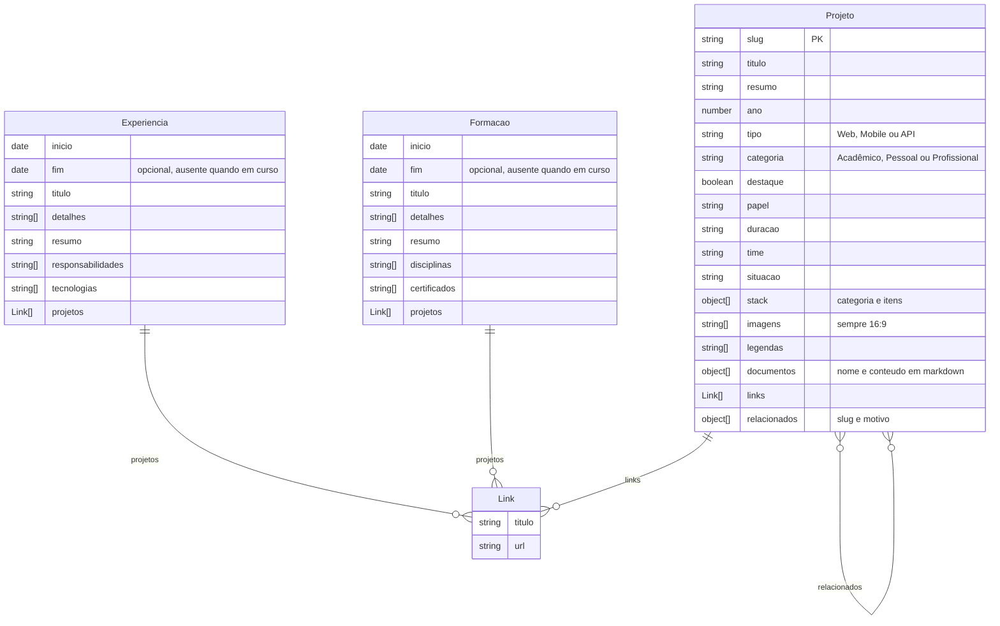

# Entidades

Entidades de conteúdo que o frontend exibe, a partir da seção "Modelo de dados" do handoff de
design (`README.md`). Os nomes abaixo seguem o handoff, em português; no código, tipos e campos
serão escritos em inglês, conforme a convenção de identificadores do `.claude/CLAUDE.md`.

Hoje não existe backend: esses dados vêm de mock no frontend (requisito R1, ver
[`product/overview.md`](../product/overview.md)), e o mock em si é entregue numa issue própria.

Observações sobre o diagrama:

- `Link` não tem identidade própria: é um par `titulo`/`url` embutido em `Projeto.links` e em
  `projetos` de `Experiencia` e `Formacao`.
- `Projeto.relacionados` aponta para outros projetos pelo `slug`, com o `motivo` da relação.
- `stack` e `documentos` de `Projeto` são listas de objetos embutidos, descritas no comentário de
  cada campo.
- `fim` ausente em `Experiencia` e `Formacao` indica período em curso, exibido como
  `desde MM/AAAA`.

