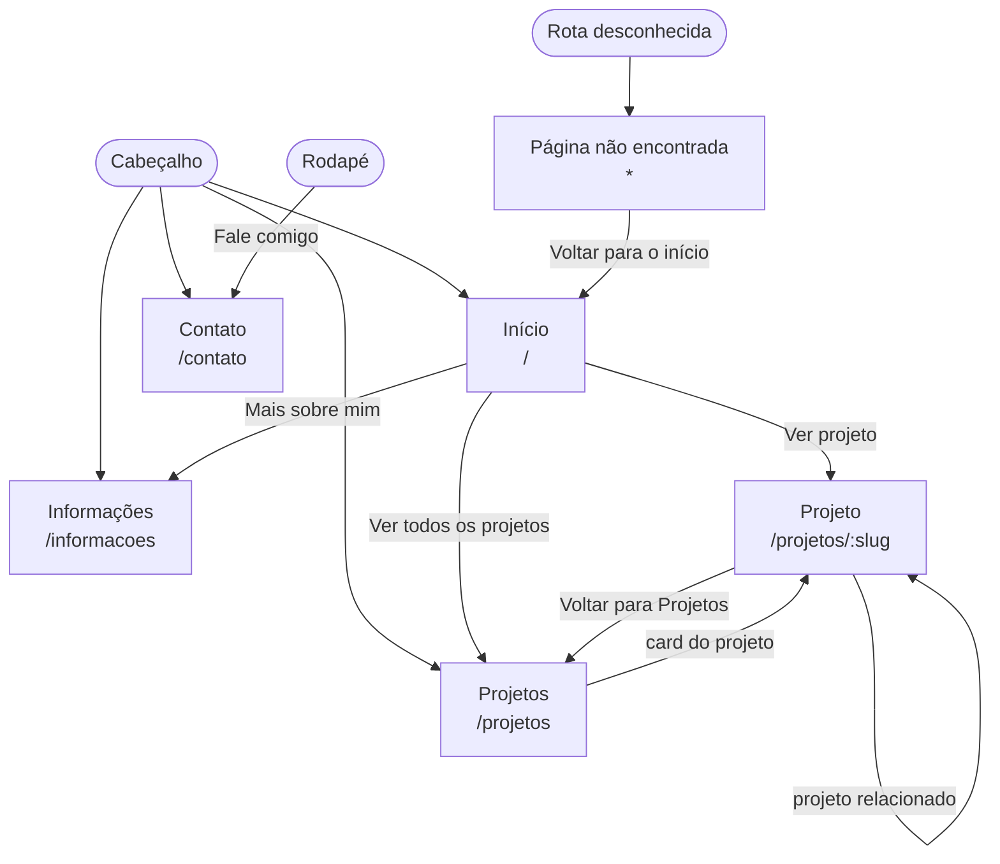

# Fluxo de navegação

Caminhos entre as telas do portfólio, conforme a arquitetura de informação do handoff de design
(`README.md` e telas `*.dc.html`). O cabeçalho é o mesmo em todas as telas e leva às quatro
seções; o rodapé leva ao contato em todas as telas exceto em `/contato`, onde vira navegação.

Hoje só `/` (Início) e a rota `*` (Página não encontrada) existem no código. As rotas
`/projetos`, `/projetos/:slug`, `/informacoes` e `/contato` chegam com as specs de cada tela.

